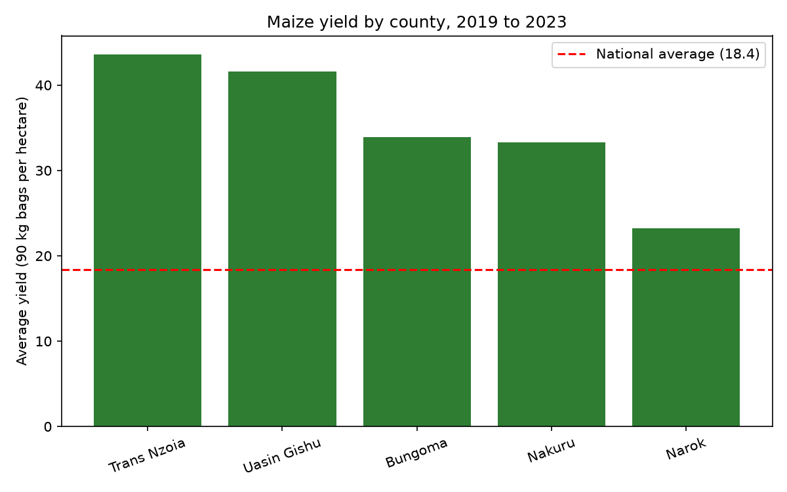
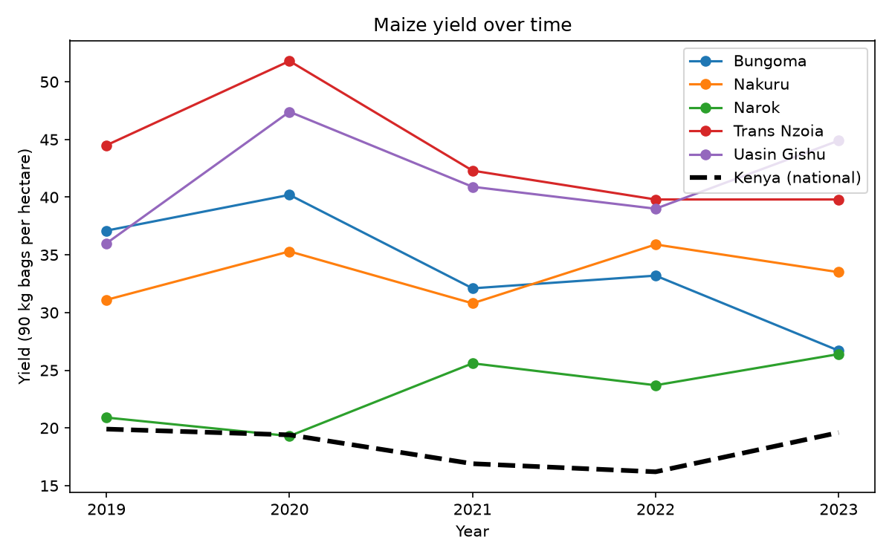

# Maize Yield and Rainfall in Kenya: A Linear Regression Study

Does rainfall explain how much maize Kenyan farmers harvest? This project tests that question
with linear regression, first on national data and then on five major maize-growing counties.

## Key findings

- **Nationally, rainfall explains little.** Using 11 years of national yield data, the rainfall
  effect is small and not statistically significant (adjusted R² = 0.12, p = 0.158).
- **Across counties the link looks strong, but it is misleading.** A simple county model gives
  +44 kg/acre per extra 100 mm of rain (adjusted R² = 0.56), but this mixes real rainfall effects
  with permanent differences between counties (soil, altitude, farming system).
- **Controlling for county leaves a smaller, real effect.** Within the same county, 100 mm more
  seasonal rainfall goes with about **+18 kg/acre** of maize (p = 0.037, 95% interval roughly
  1 to 35 kg/acre). Adjusted R² is 0.79, and this model fits best (lowest AIC of the two county models).
- **Trans Nzoia and Uasin Gishu have the highest yields** of the five counties, about
  42 to 44 bags per hectare on average, more than double the national average of 18.4.

## Research question

How much of the variation in maize yield can be explained by seasonal rainfall, and does the answer
change between national and county level?

## Data

| Variable | Source | Coverage |
|---|---|---|
| National maize yield | Ministry of Agriculture, Economic Review of Agriculture (2010-2014); KNBS national area and production (2019-2024) | 11 years, gap in 2015-2018 |
| County maize yield | KNBS National Agriculture Production Report 2024 (area and production by county), converted to bags per hectare | 5 counties, 2019-2023 (2023 provisional) |
| Rainfall, temperature | NASA POWER monthly point data | 2010-2024, one point per county (approximate main town) |

Yield is expressed in 90 kg bags per hectare (tonnes / 0.09 / hectares) and converted to kg per
acre for the models. Seasonal rainfall is the total for March to August. Raw files are in
`data/raw/` and are never edited. Cleaned data is in `data/processed/`.

Fertilizer use was not modelled because no county-level fertilizer data was found.

## Method

Three linear regressions of yield (kg/acre) on seasonal rainfall (mm):

1. **National, rainfall only** (11 years)
2. **County, rainfall only** (5 counties x 5 years = 25 rows)
3. **County, rainfall + county effects** (adds a separate baseline for each county)

## Results

### Yield by county

Average maize yield, 2019-2023, in 90 kg bags per hectare. National average for the same years: **18.4**.

| Rank | County | Average yield | Lowest year | Highest year | vs national |
|---|---|---|---|---|---|
| 1 | Trans Nzoia | 43.6 | 39.8 | 51.8 | +137% |
| 2 | Uasin Gishu | 41.6 | 36.0 | 47.4 | +126% |
| 3 | Bungoma | 33.9 | 26.7 | 40.2 | +84% |
| 4 | Nakuru | 33.3 | 30.8 | 35.9 | +81% |
| 5 | Narok | 23.2 | 19.3 | 26.4 | +26% |

These are five of Kenya's main maize counties chosen for this study, so they are expected to beat
the national average. This is not a ranking of all counties, and Bungoma and Nakuru are effectively tied.




### Regression models

| Model | Data | n | Rainfall effect (kg/acre per mm) | 95% interval | p-value | Effect of +100 mm | Adj. R² | AIC |
|---|---|---|---|---|---|---|---|---|
| 1. Rainfall only | National | 11 | 0.0757 | -0.036 to 0.187 | 0.158 | +7.6 kg/acre | 0.120 | 114.3 |
| 2. Rainfall only | 5 counties | 25 | 0.4398 | 0.279 to 0.601 | <0.001 | +44.0 kg/acre | 0.564 | 337.8 |
| 3. Rainfall + county effects | 5 counties | 25 | 0.1803 | 0.012 to 0.349 | 0.037 | +18.0 kg/acre | 0.792 | 322.5 |

AIC (lower is better) can only be compared between Models 2 and 3, which use the same data.


The same tables are in `outputs/maize_results.xlsx` (built by `src/export_excel.py`).

## Limitations

- **Small sample.** Only 11 national and 25 county observations, so estimates are uncertain.
- **Rows are not independent.** The 25 county rows are 5 counties observed over 5 years, so the
  p-values are likely too optimistic.
- **Rainfall is approximate.** Satellite-based estimates at one point per county do not represent
  the whole county.
- **Missing factors.** Fertilizer, seed type, pests (such as fall armyworm), soil, and farming
  practice are not in the models.
- **Data quality.** County figures are official but can be revised (2023 is provisional), and the
  national series combines two sources that may use different methods.
- **Association, not proof of cause.**

## How to run

```bash
pip install -r requirements.txt
python src/download_rainfall.py
python src/compare_yields.py
python src/merge_data.py data/raw/yield_data_national.csv data/processed/maize_data_national.csv
python src/merge_data.py data/raw/yield_data_county.csv data/processed/maize_data_county.csv
python src/maize_yield_regression.py data/processed/maize_data_national.csv
python src/maize_yield_regression.py data/processed/maize_data_county.csv
python src/export_excel.py
```

Use `python src/maize_yield_regression.py --demo` to test the model script on fake data
(the results are meaningless).

## Project structure

```
data/raw/         yield files and NASA POWER downloads (never edited)
data/processed/   merged, model-ready files
src/              download, merge, compare, regression and Excel export scripts
outputs/          plots, result files and maize_results.xlsx
```

## Next steps

- Add the 2015-2018 national years and more counties.
- Find county-level fertilizer data.
- Add a maize price model.
- Build a simple web demo for predicting yield.

## Author

_lucid dev, dekut, @lawrencenjeri4-lgtm_
