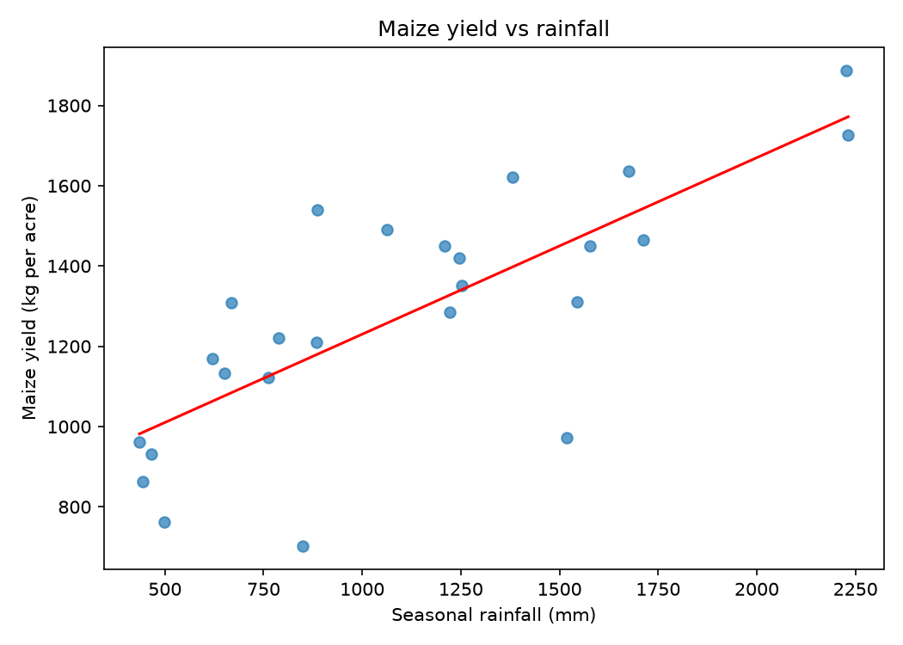

# Maize Yield and Rainfall in Kenya: A Linear Regression Study

## Problem
Maize is Kenya's staple food, and most of it is grown on rain-fed farms. This project
uses linear regression to measure how much rainfall (and fertilizer, where data allows)
explains changes in maize yield.

## Research question
How much of the variation in maize yield per acre/hectare can be explained by
seasonal rainfall and fertilizer use?

## Data
| Variable | Source | Coverage | Date downloaded |
|---|---|---|---|
| Maize yield, area planted | _e.g. Ministry of Agriculture Economic Review of Agriculture / KNBS Economic Survey_ | _years, level (national/county)_ | _date_ |
| Rainfall, temperature | NASA POWER (monthly, point data) | _years, locations_ | _date_ |
| Fertilizer use | _source, or "not available at county level"_ | _years_ | _date_ |

Raw files are in `data/raw/` and are never edited. Cleaned data is in `data/processed/`.

## Method
1. Download and clean the data (`src/download_rainfall.py`, plus manual yield data).
2. Merge yield and rainfall by county and year.
3. Fit and compare three models (`src/maize_yield_regression.py`):
   - Yield ~ rainfall
   - Yield ~ rainfall + fertilizer
   - The same with county effects
4. Check the residuals and compare adjusted R² and AIC.

## Results
_Fill in after running on real data: coefficients, R², main plot._



## Limitations
- Small sample (_n = ?_), so estimates are uncertain.
- Rainfall comes from satellite-based estimates at one point per county, which does not
  represent the whole county.
- Fertilizer data is patchy, and other factors (seed type, pests, soil, farming practice)
  are not in the model.
- Regression shows association, not proof of cause.

## How to run
```bash
pip install -r requirements.txt
python src/download_rainfall.py
python src/maize_yield_regression.py data/processed/maize_data.csv
```
Use `--demo` to test the script with fake data (results are meaningless).

## Next steps
- Add a maize price model.
- Build a simple web demo for predicting yield.

## Author
_Your name, institution, contact._
